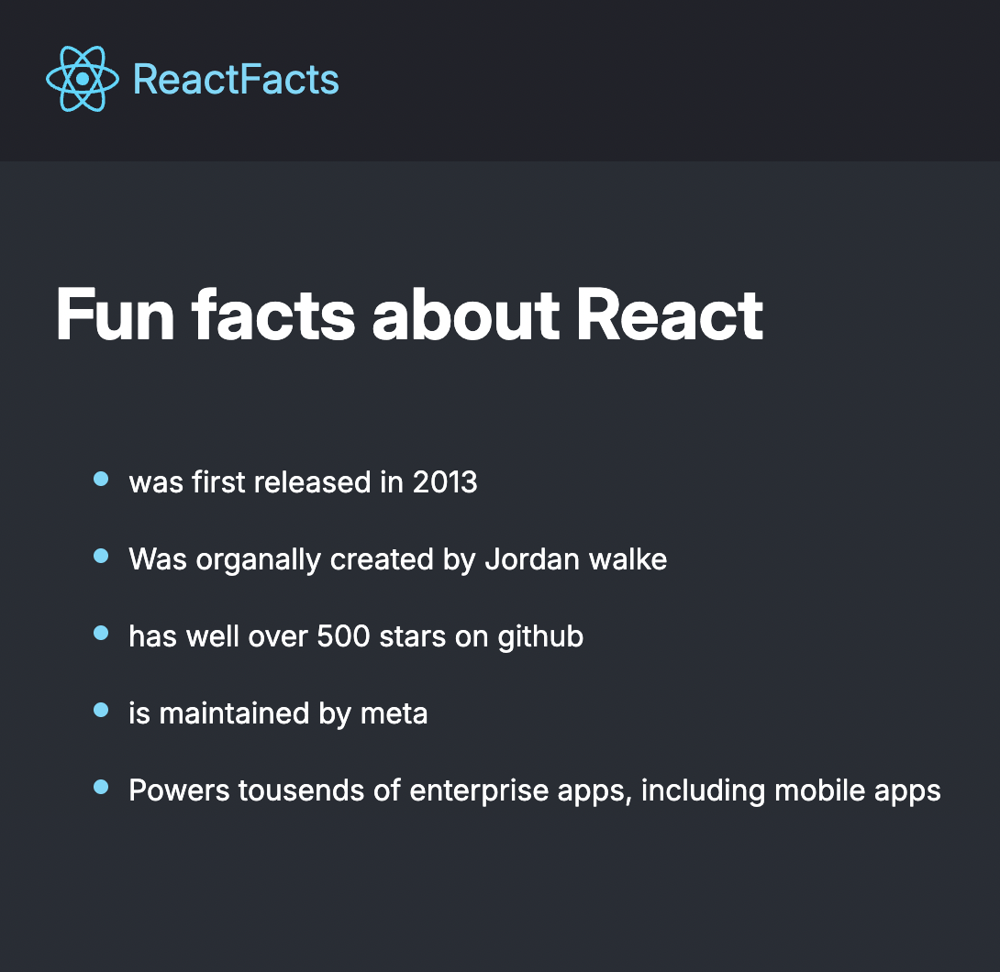
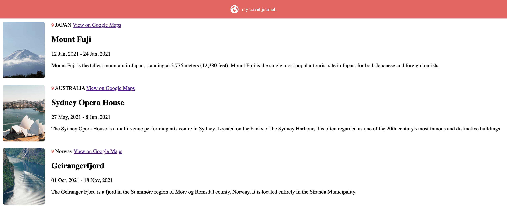

# 📌 Freecodecampprojects
This is a collection of projects from freecodecamp, its just for fun to develop my knowlage and expariance in react. In somee project the purpose is to develop in the quality of the code like reusability and more effective ways tou build an application. 


## 📖 Table of Contents

- [Projects](#projects)
- [Technologies Used](#technologies-used)
- [Installation](#installation)
- [Usage](#usage)
- [Folder Structure](#folder-structure)
- [Future Enhancements](#future-enhancements)
- [Contributing](#contributing)
- [License](#license)
- [Contact](#contact)

---

## 🚀 Projects

This collection includes the following projects:

- **React-freecodecamp** - display some basic text image and styling with bootstrap 

- **travel-journal** - A journal with location and information about visited locations (created using reusable components and props)



Each project is built using **React** and showcases different concepts of React development.

---

## 🛠 Technologies Used

- React
- JavaScript (ES6+)
- HTML5 & CSS3
- Bootstrap 


---

## 💻 Installation

To set up the projects locally, follow these steps:

```bash
# Clone the repository
git clone https://github.com/jonatangroncode/react-freecodecamp.git

# Navigate into the project directory that you want to start (every project has a folder in root)
cd travel-journal

# Install dependencies
npm install

# run project 
npm run dev